# Working from the terminal 101
## Author: Pablo Baceiredo Macho


In this tutorial, we will learn how to use the terminal to interact with the computer. We will cover the following topics:

1. [What is the terminal and why do we use it](#what-is-the-terminal-and-why-do-we-use-it)
2. [How to open the terminal](#how-to-open-the-terminal)
3. [How to navigate the file system](#how-to-navigate-the-file-system)
4. [Making, copying, moving and deleting files](#making-copying-moving-and-deleting-files)
5. [Inspecting files](#inspecting-files)
7. [Writing and executing scripts](#writing-and-executing-scripts)
8. [The remote cluster](#the-remote-cluster)

From my experience (and the experience of others), the best way to learn how to work from the terminal is to learn by doing. Therefore, I strongly recommend that you follow the practicals in the tutorial.

**DISCLAIMER:** This is an absolute-beginners tutorial, so only the basics will be covered. If you want to do more sophisticated stuff, I recommend using LLMs. They are quite good at it.

# What is the terminal and why do we use it

Normally, when we use a computer, a tablet or a smartphone, we touch or click on icons to open files or applications and we use a mouse or a touch screen to navigate through the system. This is called a ***graphical user interface (GUI)*** --- *graphical*, because it uses visual elements (e.g. icons) and *interface*, because it serves as an intermediate between the user and the operating system (OS), i.e. the software that manages the computer's hardware and applications.

There is, however, another way to interact with the computer: the ***command line interface (CLI)***. The CLI is an interface that is based on *text commands*. This means that, instead of clicking on icons, we type commands to tell the computer what to do. We type these commands in the ***terminal***. The terminal is a program that provides access to the command line interface (CLI).

But, if the GUI is so easy and intuitive, why would we want to use the CLI? Although it is true that the GUI is more user-friendly and that quick actions (e.g., opening a file or navigating through directories), there are several reasons to use the CLI:

- **Automation**: The CLI allows us to automate repetitive tasks by writing scripts. This is especially useful when we have to process large amounts of data or perform complex operations. For example, if we have to rename hundreds of files, we can write a script that does it for us in a few seconds, instead of doing it manually one by one.
- **Remote access**: The CLI allows us to access and control *remote computers*, such as servers or clusters, through a network connection. This is useful when we want to run programs or analyze data on a powerful machine that is not physically accessible to us. This will be especially relevant for us, because we will be using the ILF cluster to run our analyses.
- **Efficiency**: The CLI is often faster and more efficient than the GUI, especially for advanced users who are familiar with the commands. For example, we can perform complex operations with a single command, instead of navigating through multiple menus and windows.
- **Reproducibility**: We can save the exact commands we typed into a script or a text file. This is important if someone else wants to do the same analysis in the future, or even if we ourselves want to repeat it --- you'll be amazed how easy it is to forget the steps you made in the past! By saving the commands, we can ensure that the analysis can be reproduced exactly as it was done before.


# How to open the terminal

Enough with the talking! Let's open the terminal and start using it. The way to open the terminal depends on the operating system (OS) we are using. The most common OSs are Windows, macOS and Linux.

- **Windows**: The terminal is called *Command Prompt* or *PowerShell*. To open it, we can search for "cmd" or "PowerShell" in the Start menu and click on the corresponding application. Alternatively, we can use the keyboard shortcut `Win + R`, type "cmd" or "powershell" and press Enter.
- **macOS**: The terminal is called *Terminal*. To open it, we can search for "Terminal" in Spotlight (the magnifying glass icon in the top right corner) and click on the corresponding application. Alternatively, we can use the keyboard shortcut `Cmd + Space`, type "Terminal" and press Enter.
- **Linux**: The terminal is called *Terminal* or *Console*. To open it, we can search for "Terminal" in the application menu and click on the corresponding application. Alternatively, we can use the keyboard shortcut `Ctrl + Alt + T`.

In my case (macOS), when I open it, I see something like this:

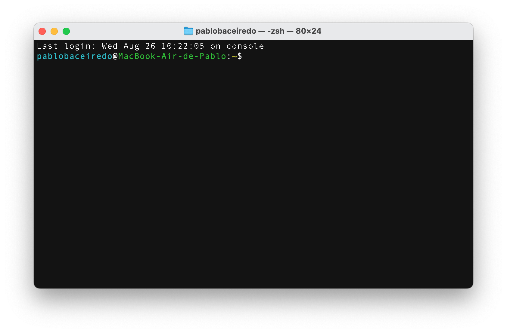

You should be able to write commands after the `$` symbol. The `$` symbol is called the *prompt* and it indicates that the terminal is ready to receive commands. The prompt may look different depending on the OS, the shell (the program that interprets the commands) and the configuration, but it usually ends with a `$`, `>`, or `#` symbol.


# How to navigate the file system

When you open the terminal, you land somewhere, i.e. in a specific *directory* (or *folder*). A directory is a container that can hold files and even other directories. The directory you land in when you open the terminal is called your *home directory*, and is usually represented by a tilde (`~`). You can see it just before the prompt `$`. 

Of course, you can move from one directory to another, so that you can access the files and run scripts elsewhere in your file system. Before we explain how to do this, we need to know the how the directories are organized in the file system.

The file system is organized in a hierarchical structure, like a tree. 

- The top of the tree is called the *root directory* and it is represented by a `/` symbol. 
- From the root directory, we can have several directories, which can contain other directories, and so on. For example, within the root directory we can have a directory called `Users`, which contains a directory called `me`, which contains a directory called `Documents`, which contains a file called `file.txt`. 
- To indicate where a file is located, we use the *path* to that file. The path to the file above would be `/Users/me/Documents/file.txt`.
- There are 2 important wildcards that we can use to navigate the file system: `.` and `..`. 
  - The `.` wildcard refers to the current directory. Therefore, if we are in the `/Users/me/Documents` directory, we can use `.` to refer to the same directory (and so save some typing, because paths can get very long).
  - The `..` wildcard refers to the parent directory. The parent directory is the directory that contains the current directory, i.e. the directory just above it. For example, if we are in the `/Users/me/Documents` directory, we can use `..` to refer to the `/Users/me` directory, because `..` means "go up one level".

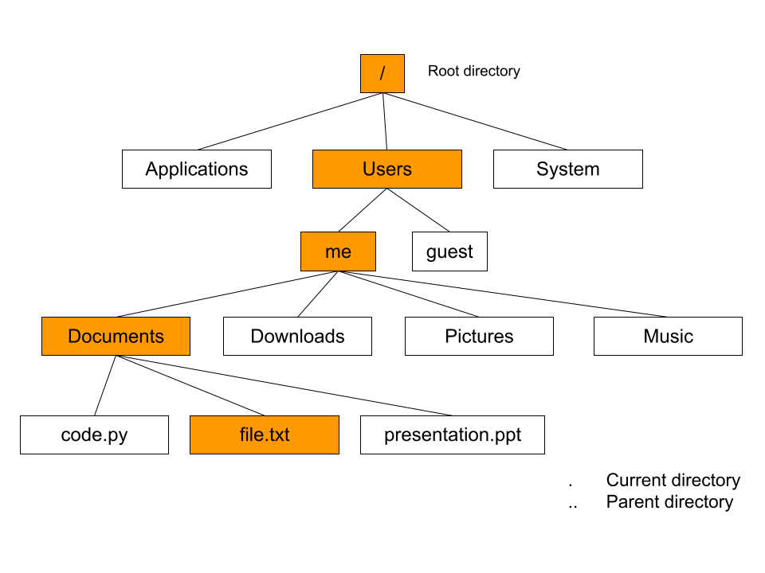


## Check the current directory

In the terminal, you can **check which directory you are in** by typing the command `pwd` (which stands for *print working directory*) and pressing Enter.

```bash
pwd
```

For example, in my case, the output is:

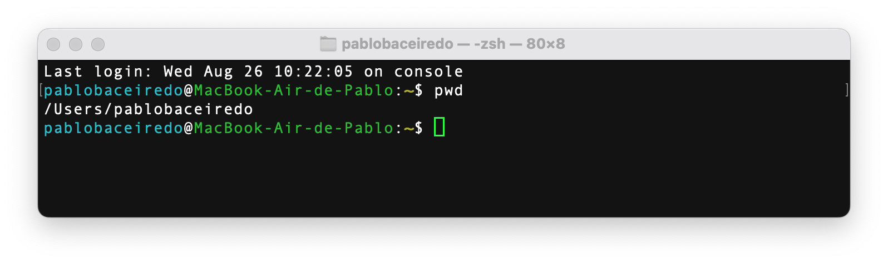


## Find what is inside the directory

We can **find what is inside our directory**. We can do this by typing the command `ls` (which stands for *list*) and pressing Enter.

```bash
ls
```

For example, in my case, the output is:

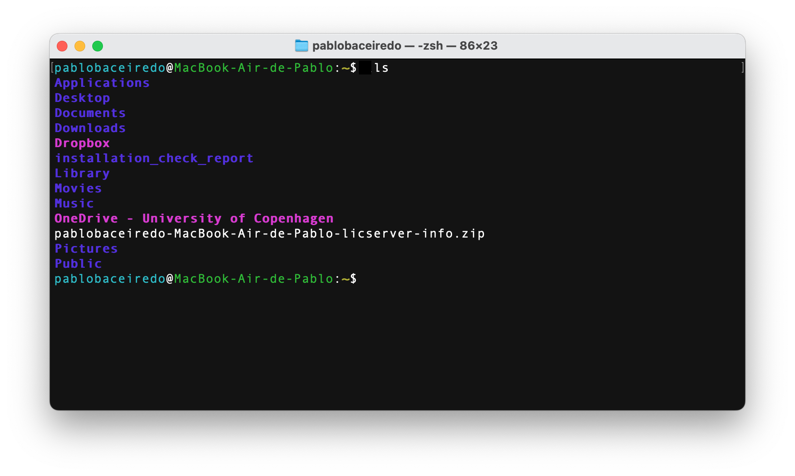

As you can see, there are several other directories inside my home directory (colored in purple ^[Don't worry if you don't see the colors, you shouldn't, it depends on the configuration of your terminal.]). You might have noticed that the output of `ls` is not very informative, because it only shows the names of the files and directories. To modify the behaviour of the `ls` command we can use *options*. For example, if we want to order them by modification time, we use the option `-t`, if we want to show the long listing format (showing size, access rigths, owner, etc. --- more on that later), we can use the option `-l`, and so on and so forth. 

```bash
ls -t   # order by modification time
ls -l   # long listing format
ls -lt  # we can even combine them!
```

If you want to look for a particular file or directory (e.g. if you want to check if a file called `my_file.txt` is in the current directory), you can pass the file or directory name as an argument to the `ls` command. For example:

```bash
ls my_file.txt
```

If you want to know more about the different `ls` options, take a look at [this website](https://www.w3schools.com/bash/bash_ls.php).

So now, what if we want to move to one of those directories?

## Move between directories

We can **move between directories** using the `cd` command (which stands for *change directory*), followed by the path we want to move to. You can use either the *absolute path* (starting from the root directory) or the *relative path* (starting from the current directory). 

For example, if we want to move to the `Documents` directory, we can use either of the following commands:

```bash
cd /Users/me/Documents  # absolute path
cd Documents            # relative path
```

Both are equally valid, but the relative path is shorter and easier to type.

So, for example, let's move to the `Documents` directory and check what is inside it:

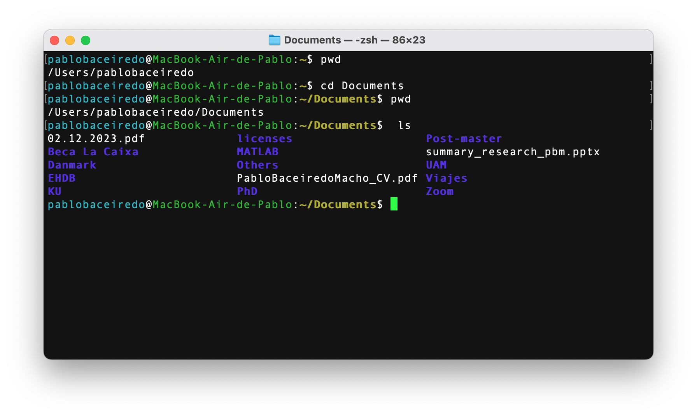


# Making, copying, moving and deleting files

Moving is great and all, but we also want to create files and directories, copy them and move them around. Let's see how to do that.

## Create a new directory

To create a new directory within the working directory, we can use the `mkdir` command (which stands for *make directory*), followed by the name of the new directory. For example, if we want to create a new directory called `my_dir`, we can use the following command:

```bash
mkdir my_dir
```

Let's create it and check that it is there:

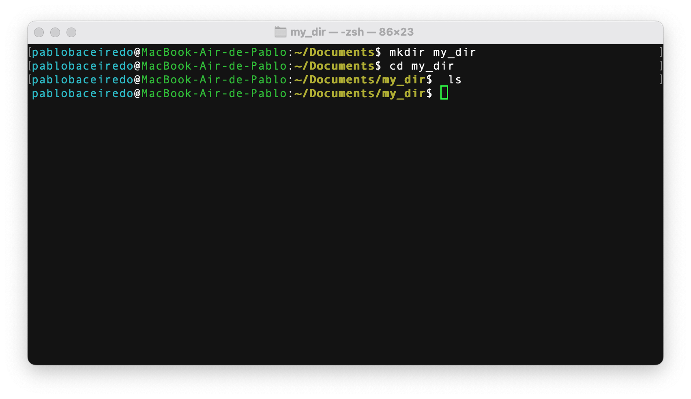

As we expected, the new directory `my_dir` is empty, because there is no output to `ls`.

## Create a new file

We can create files using different commands. One of them is the `nano` command, which opens a text editor in the terminal. We can use it to create a new file and write some text in it. For example, if we want to create a new file called `my_file.txt`, we can use the following command:

```bash
nano my_file.txt
```

This will open the `nano` text editor, where we can write some text. Once we are done, we can save the file by pressing `Ctrl + O`, then press Enter to confirm the file name, and finally exit the editor by pressing `Ctrl + X`. Let's try it:

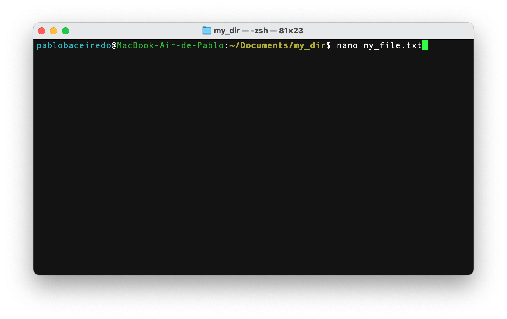
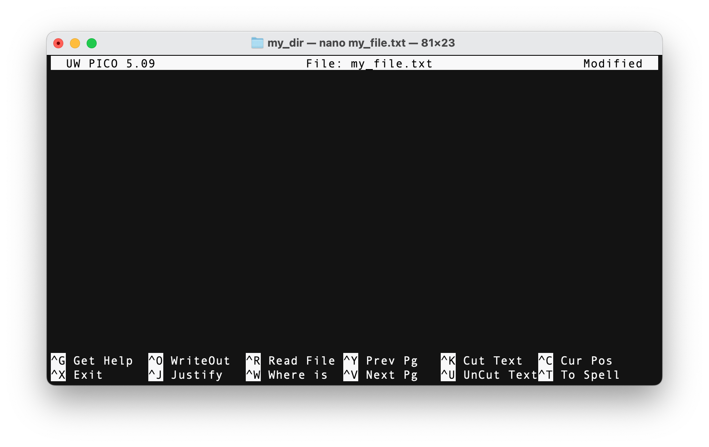
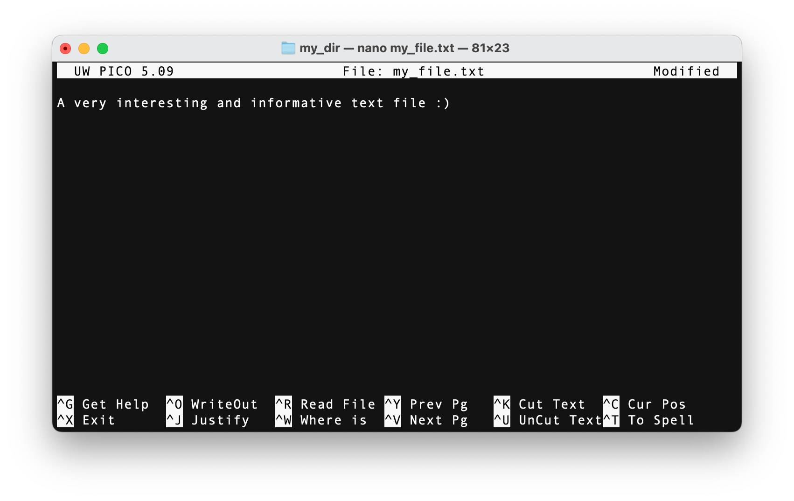

As you see, we created the file `my_file.txt`, wrote some text in it, saved it and closed it. Then, we can check that it is there by using the `ls` command:

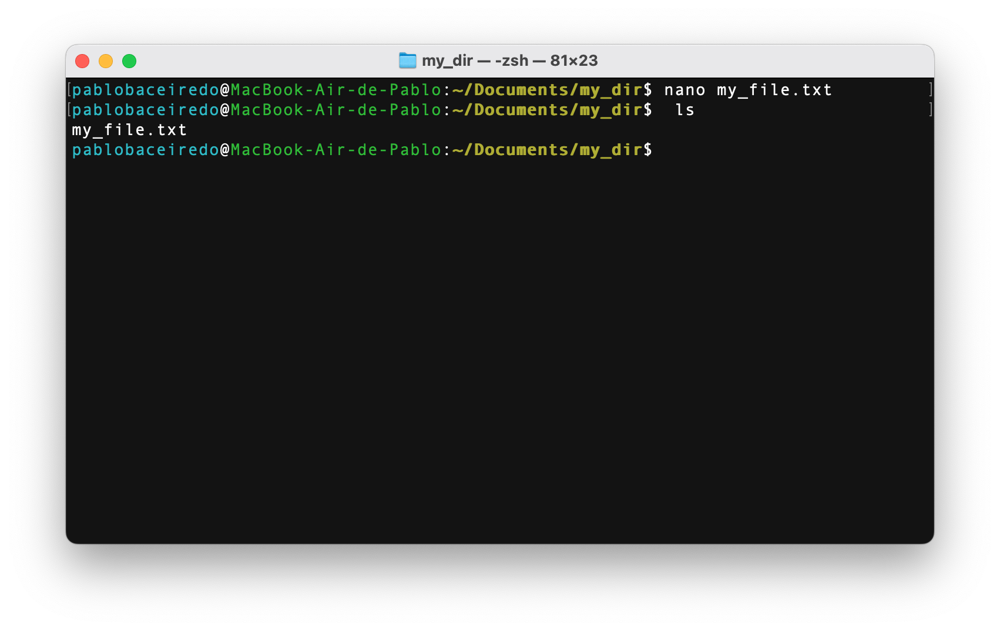

A very widespread alternative to `nano` is `vim` (or `vi`), which is a more powerful text editor, but also more complex to use. You are free to learn how `vi`/`vim` works, and we highly recommend using an LLM (like ChatGPT) to help you with that.

## Moving and copying files

To copy files, we can use the `cp` command (which stands for *copy*), followed by the source file and the destination file. For example, if we want to copy the file `my_file.txt` to a new file called `my_file_copy.txt`, we can use the following command:

```bash
cp my_file.txt my_file_copy.txt
```

We can also copy files to another directory. For example, if we want to copy the file `my_file.txt` to the directory `my_dir`, we can use the following command:

```bash
cp my_file.txt my_dir/my_file.txt
```

We can also copy directories and their contents using the `-r` option (which stands for *recursive*). For example, if we want to copy the directory `my_dir` and all its contents to a new directory called `my_dir_copy`, we can use the following command:

```bash
cp -r my_dir my_dir_copy
```

Note that copying a file to another directory does not remove the original file, it just creates a new copy of it in the destination directory. If we want to move a file (i.e., remove it from the source directory and place it in the destination directory), we can use the `mv` command (which stands for *move*), followed by the source file and the destination file. For example, if we want to move the file `my_file.txt` to the directory `my_dir`, we can use the following command:

```bash
mv my_file.txt my_dir/my_file.txt
```

Once again, you can also move directories and their contents using the `mv` command. For example, if we want to move the directory `my_dir` to a new directory called `my_dir_moved`, we can use the following command:

```bash
mv my_dir my_dir_moved
```

## Removing files and directories

Eliminating files and directories is also very easy, but one must be extremely careful. When we remove a file or directory using the terminal, **it is gone *forever* and there is no way to recover it**. This is different from the GUI, because

- there is **no trash or recycle bin** in the terminal, and
- there is **no confirmation prompt** before deleting a file or directory.

Therefore, the removing commands should be used with caution. To remove a file, we can use the `rm` command (which stands for *remove*), followed by the name of the file. For example, if we want to remove the file `my_file.txt`, we can use the following command:

```bash
rm my_file.txt
```

And then the file is gone forever. Check the following example: we first create a file called `my_file.txt`, check that it is there using `ls`, then we remove it, and finally we check that it is gone:

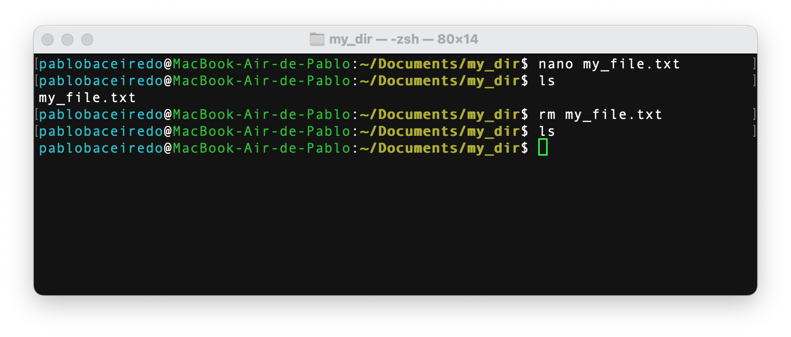

There are **3 important options** that we can use with the `rm` command:

- `-i` (*interactive*): This option prompts us for confirmation before removing a file. After being asked, we should type `y` to confirm or `n` to cancel. For example:

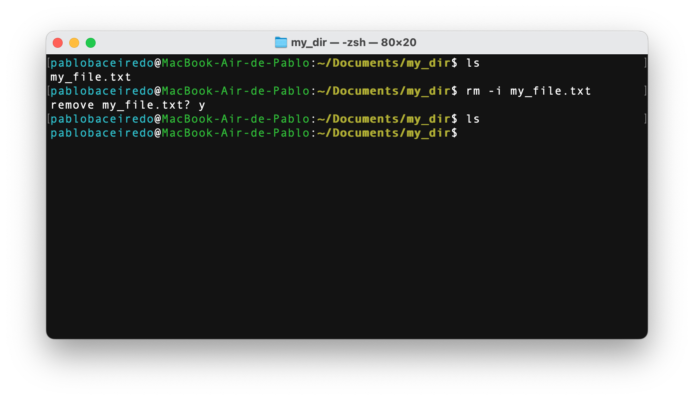

- `-r` (*recursive*): If we try to remove a whole directory (and all its contents) using just `rm`, the system will print a warning. Therefore, if we want to remove a directory and all its contents, we can use the `-r` option. Note that using the `-r` option will remove all files and subdirectories within the specified directory, so use it with caution. For example, if we want to remove the directory `my_dir` and all its contents:

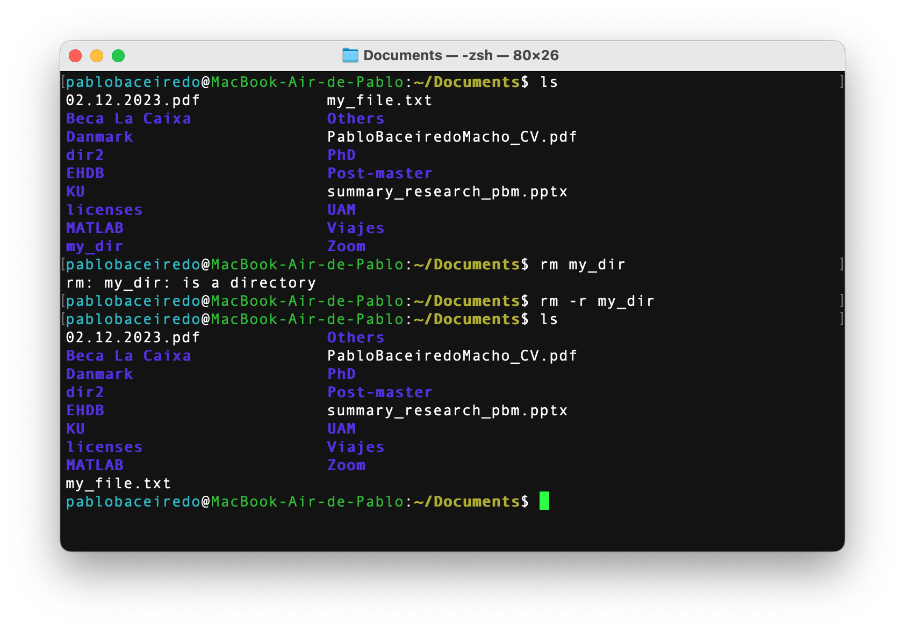

- `-f` (*force*): This option forces the removal of files and directories without prompting for confirmation, even if they are locked or protected. This is a very dangerous option, because it will remove everything without asking, so we strongly recommend not using it unless you are absolutely sure of what you are doing.

**WARNING! The nuclear option `rm -rf`.** When you combine the `-r` and `-f` options, you get the `rm -rf` command, which is a very powerful and dangerous command that can delete entire directories and their contents without any confirmation. This command should be used with extreme caution, because it can easily lead to data loss if used incorrectly. **Especially, never use it with the root directory (`/`), because it will delete everything in your system and render it unusable.** You wouldn't be the first to lose their entire operating system by accidentally typing `rm -rf /` instead of `rm -rf *`. Therefore, we strongly recommend not using this command unless you are absolutely sure of what you are doing.


# Inspecting files

## Displaying the content of a file

When we use `nano` or `vim` to create a file, we can also use them to read the contents of a file. However, there are other commands that are more suitable for this task, because they allow us to read files without opening a text editor. The command we use will be different depending on the action we want to perform.

- `cat` (concatenate): This command allows us to read the entire contents of a file and print it to the terminal. It is nice for short files, but do not use it for huge files, because it will print everything at once and you will have to scroll through it (also possibly crashing your terminal).
- `less`: For large files, we can use the `less` command, which allows us to read the contents of a file one page at a time. We can scroll through the file using the arrow keys or the space bar, and we can exit by pressing `q`.
- `head` and `tail`: These commands allow us to read the beginning or end of a file, respectively. For example, `head my_file.txt` will display the first 10 lines of the file, while `tail my_file.txt` will display the last 10 lines. You can change the number of lines displayed by using the `-n` option, e.g. `head -n 20 my_file.txt` will display the first 20 lines of the file.

For example, a file called `numbers.txt` contains the numbers 1 to 20, one per line. Thus, if we use the commands explained above, we get the following outputs:

`cat` command:
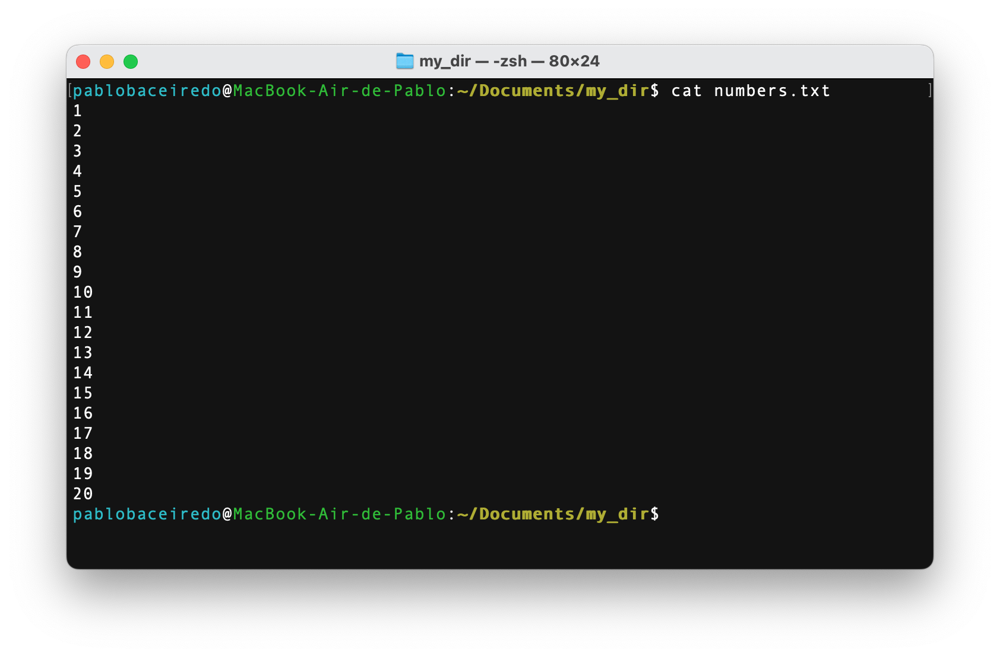

`less` command (1) --- We press enter and see the output in a new screen:
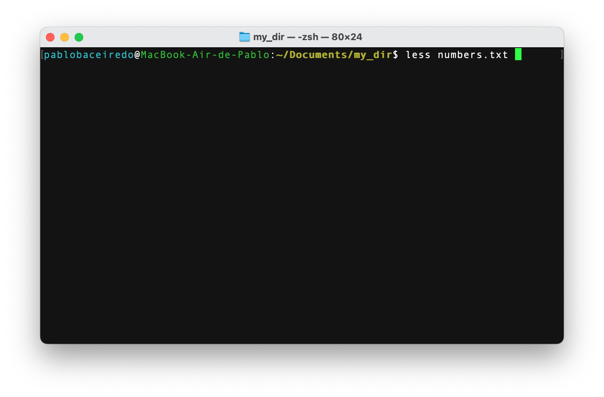

`less` command (2) --- We can scroll through the file using the arrow keys or the space bar. When we are done, we can exit by pressing `q`:
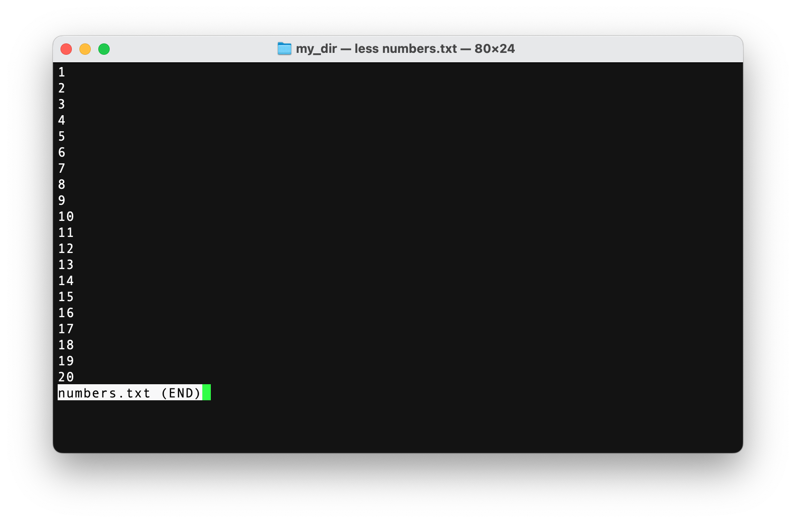

`head` and `tail` commands:
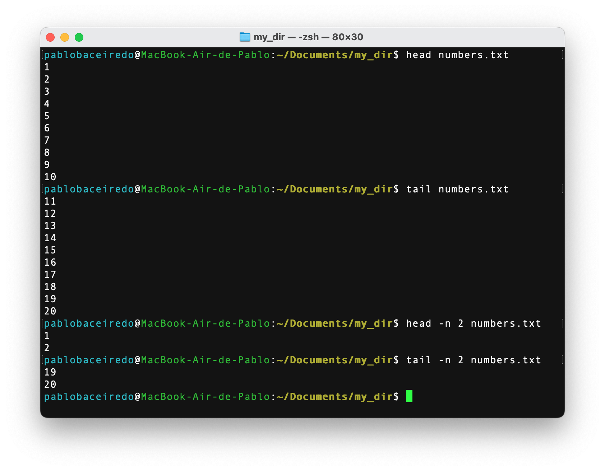


## Finding matches and counting lines, words and characters

Sometimes we want to find a specific word, number or string in a file, or count the number of lines, words and characters in a file. If the file is small, we can do it manually with the commands above, sure. However, you will find that it is way easier and more efficient to use specific commands for this.

- `grep`: This command allows us to search for a specific word, number or string in a file. For example, `grep "9" numbers.txt` will display all the lines that contain the number 9 in the file. We can also use options to modify the behaviour of the command, e.g. `-i` to ignore case, `-n` to show line numbers, etc. You are free to ask ChatGPT for more information about the different `grep` options.

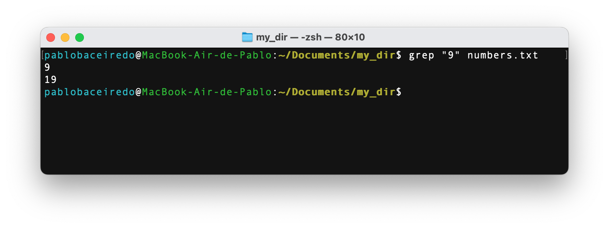

- `wc` (*word count*): This command allows us to count the number of lines, words, and characters in a file. For example, `wc my_file.txt` will display the number of lines, words, and characters in the file (in that order). You can also use options to count only lines (`-l`), words (`-w`), or characters (`-c`). For example, `wc -l my_file.txt` will display only the number of lines in the file.

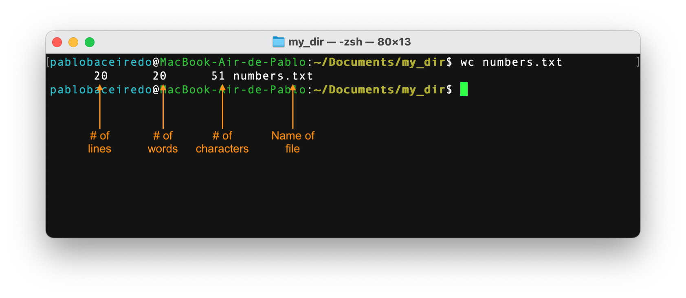

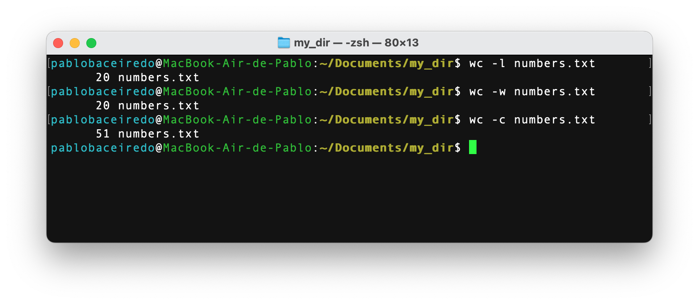


# Writing and executing scripts

## Bash scripts

Writing one command at a time is fine for simple tasks, but when we want to perform more complex operations or automate repetitive tasks, it is better to write a script. A script is a file that contains a series of commands that can be executed in sequence. Here, we will focus on *bash scripts*, which are scripts written for the bash shell (the default shell in most Linux and macOS systems).

To create a bash script, we can use a text editor (e.g., `nano` or `vim`) to create a new file with the `.sh` extension. The script must:

1. Start with a **shebang line** (`#!/bin/bash`). This line just tells the operating system which interpreter to use to execute the script. If we are using a different language (e.g., Python, R, etc.), we would use a different shebang line (e.g., `#!/usr/bin/env python` for Python).
2. Contain the **commands** we want to execute, *one per line*^[It is good practice to include comments explaining what the command do. We can do this by adding a `#` at the beginning of the line. The `#` will indicate that the line is a comment and will not be executed.].
3. **Be made executable** using the `chmod` command. By default, a new file is not executable, so we need to change its permissions to allow execution. To do so, we just use the `chmod` command with the `+x` (*add execute*) option, followed by the name of the script (more on `chmod` and access rights in the [appendix](#appendix-1-access-rights)).

For instance, let's create a simple bash script called `my_script.sh` that prints the current working directory and lists the files in it. I'll use `vi` to create the script, but you can use any text editor you like.

```bash
vi my_script.sh   # or 'nano my_script.sh'
```

This will open the text editor. There, we can write the following lines:

```bash
#!/bin/bash   # Shebang line: always the first line of a bash script

# here we include the commands
echo "Current working directory:"   # 'echo' simply prints to screen whatever is stated next to the command
pwd                                 # returns the current working directory

echo "Files and directories in this directory:"
ls
```

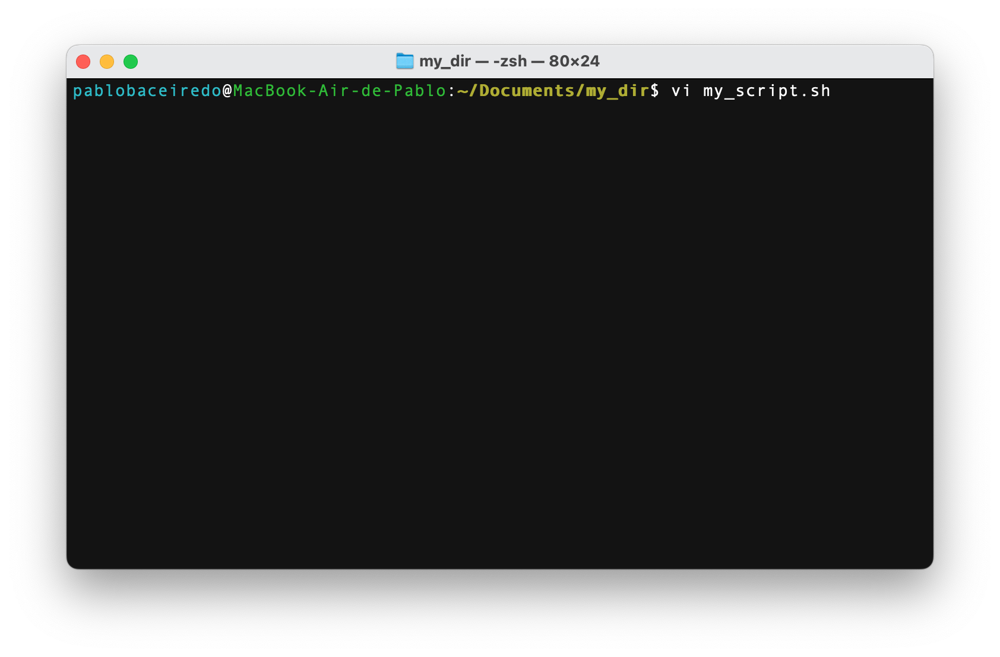

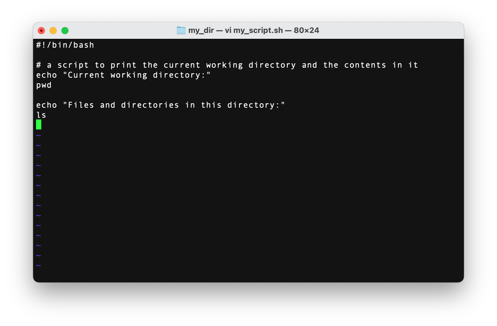

We save it and close the text editor. Feel free to check whether the script file is there!

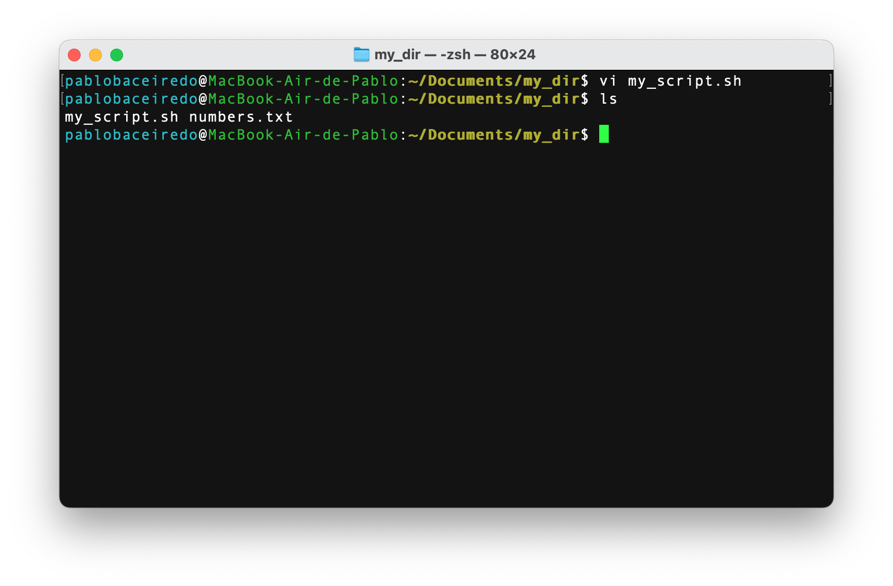

Now, how do we execute it? Remember that first we need to be able to execute it, or, in technical terms, have *execution permission*. By default, no new files are ready to be executed because the don't have execution permission, so we need to change the access rights. We do that with the `chmod` command followed by `+x` and the file name, which basically means 'change file mode to add execution permission to this file.'

```bash
chmod +x my_script.sh
```

Now, if you list the directory, you'll see that the file name changed colors! That shows that it has been made executable.

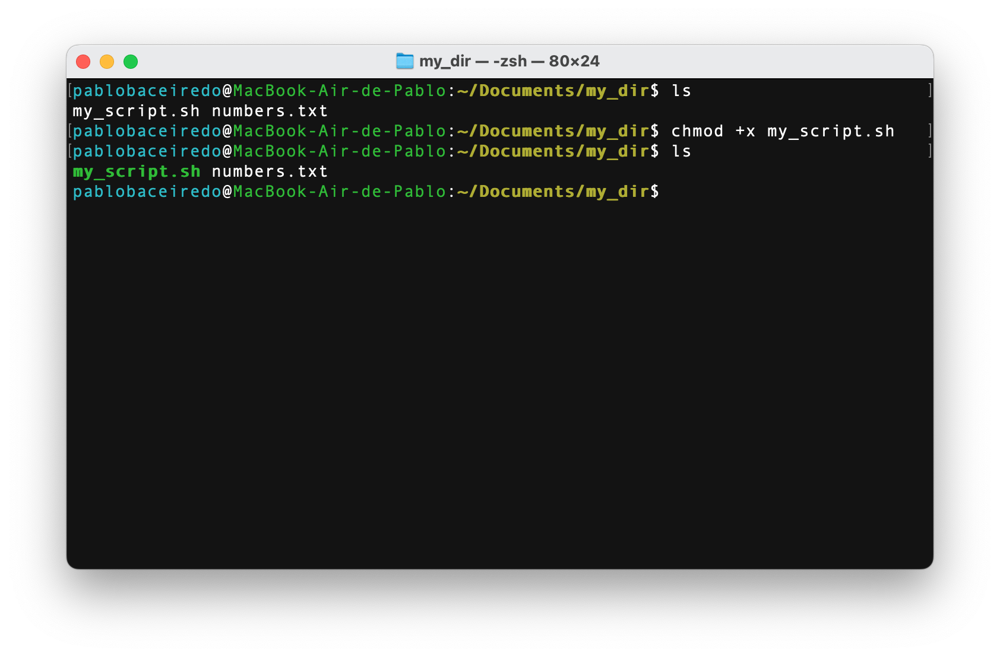

**And how do we *actually* run the script?** To do so, we just type the script file name, with `./`. Remember that the `.` means 'this directory', so `./my_script.sh` would just mean 'in this directory, run `my_script.sh`.'

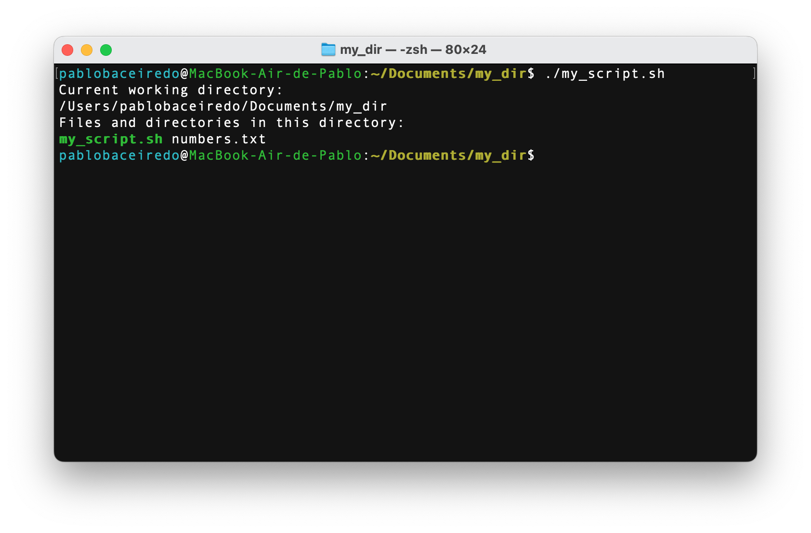

Bear in mind that this only works if the script is *in the same directory* where you are running in it from. If the script is in a different directory, we would need to write the path (absolute or relative) to it. For example, if `my_script.sh` was in the parent directory (i.e. in the directory just above to ours), we would run it like this:

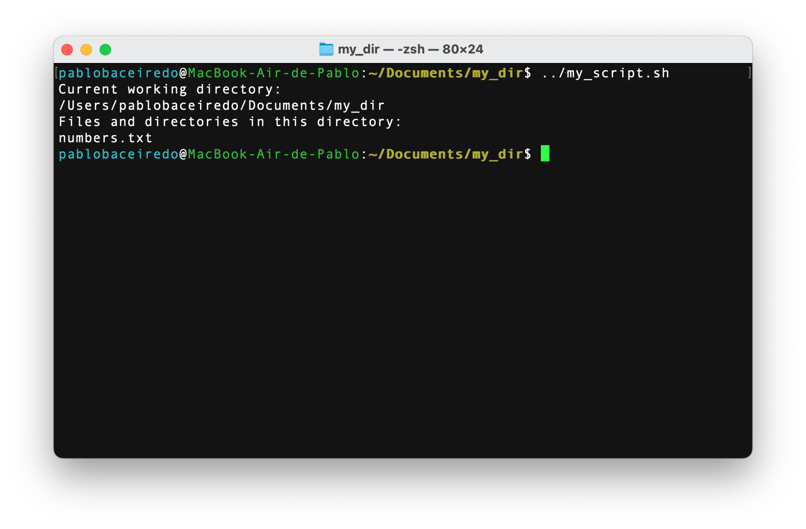

Or, if it were in the directory `~/Documents/dir2`, we would run it like this:

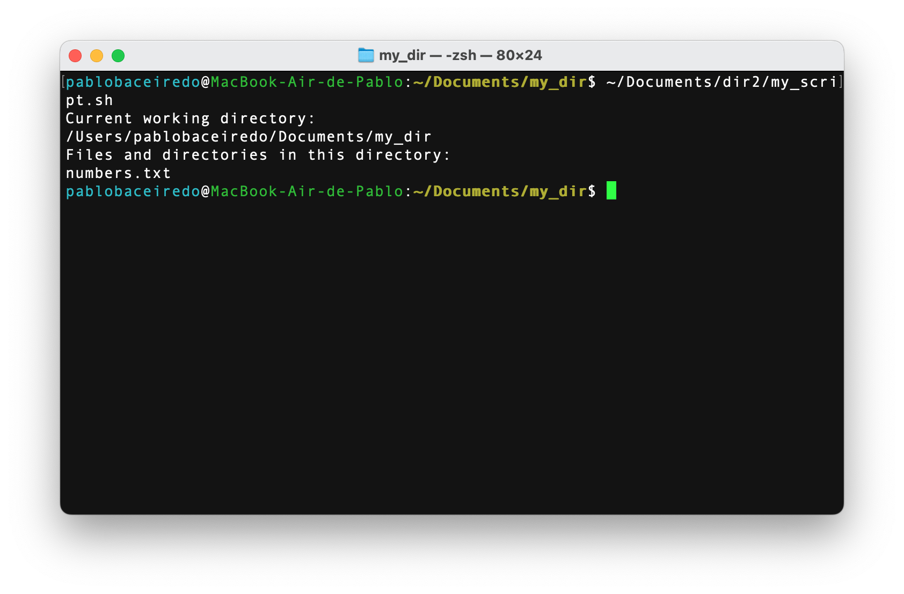

Note that, either way, the output (i.e. the current working directory that is printed and the list of items in it) always refers to the directory where the script is being runned from (not the directory where the script lies).


## Python scripts

Similarly to writing and executing bash scripts, one can write and execute scripts in other programming languages. Here, I will explain how to do it in Python, but it is similar in other languages (e.g., R). 

In general, the procedure is the same: we create a file (in this case, with the `.py` extension), write our code and run it. The most important differences with running bash scripts are:

- **The Python shebang**: Because we are using a different language, we need the system to use a different interpreter. Before, we used `#!/bin/bash`, now we'll use `#!/usr/bin/env python`. 
- **Running the code**: We can run the Python script in 2 ways:
  - Explicitly, by typing `python my_script.py`. This calls Python explictily, letting the system know that it is a Python file. This way we don't need to change execution permissions. This is the most usual way to do it.

  ```bash
  python my_script.py
  ```

  - Making the file executable (using `chmod +x`) and then running it directly as before (`./my_script.py`). The system will know what programming language it is written in thanks to the shebang.

  ```bash
  chmod +x my_script.py   # change permissions
  ./my_script.py          # run it
  ```
- **Conda environments:** These are especially important when working on a remote cluster (more on that later). A conda environment is simply a self-contained directory that holds a specific version of Python and a specific set of packages (Python tools), separated from the rest of the computer. This is useful because different research projects need different packages and even different versions of the same packages, so it is handy to have them in separate 'toolboxes'. These toolboxes are the environments. You will find more about the conda environments in the [appendix](#appendix-2-conda-environments).


# The remote cluster

Working in your own computer is great. However, your research will eventually be too large or demanding for your PC. This can happen if your dataset is too massive to fit in your PC's memory or if a script takes a long time to finish running.

To solve this problem, we have **remote clusters** (or *servers*). A remote cluster is simply a computer that is located in a data center or other facility. These clusters are a collection of individual computers, called *nodes*, that allow us to split large tasks into smaller pieces so that many nodes can work simultaneously and our scripts and jobs can finish way quicker than they would in our PC. This is called *high-performance computing*, or HPC.

The brain inside each node can be of 2 different types:

- **CPU** (Central Processing Unit): CPUs can handle very complex tasks that might be done in a sequence (i.e. you cannot do step B until step A finishes). However, they normally don't have a lot of cores, so not many things can be done simultaneously.
- **GPU** (Graphics Processing Unit): GPUs cannot perform tasks as complex as those performed by CPUs, but they can perform a lot of tasks at the same time because they contain thousands of cores. Therefore, they are great to do the exact same simple operation to millions of data points simultaneously^[Such as ---you guessed it--- molecular simulations!].

We use HPC clusters to do our work for 3 reasons:

- **Memory:** Many of our files are larger than what our RAM can handle, so it is impossible to open them in our PCs.
- **Time:** Running a molecular simulation in our PC would take ages (I mean it: it would take years). Splitting the calculations across the GPU cores reduces this time to the order of days.
- **Parallel computing**: We can run the exact same analysis thousands of times simultaneously, without having to run it one after the next one.

Here at the Department for Drug Design and Pharmacology we use the **ILF Grid**. You can find more information about it in the [ILF Grid Wiki](https://biowiki.sund.ku.dk/wiki/Main_Page) but I will cover the very basics now.


## Connecting to the cluster

Okay, but how do we access this remote computer? 

To do so, we first need to **connect our VPN**. HPC clusters have expensive hardware and sensitive data, so they are not available in the public internet. The VPN (Virtual Private Network) creates a safe and encrypted connection between your PC and the university internet, letting you access the cluster no matter where you are.

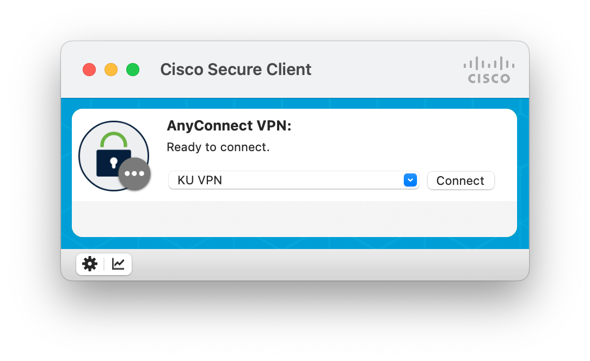

Once connected to the VPN, we need to log in to the cluster. We do this using **SSH** (Secure Shell), which creates an encrypted tunnel. In particular, to access the ILF Cluster we write:

```bash
ssh abc123@ilfgridgate    # 'abc123' is your KU ID (swedish licence plate)
```

Then it will ask you to introduce your password. You will notice that nothing will be shown to screen ---not even the '*'--- but, don't worry, your password is being typed.

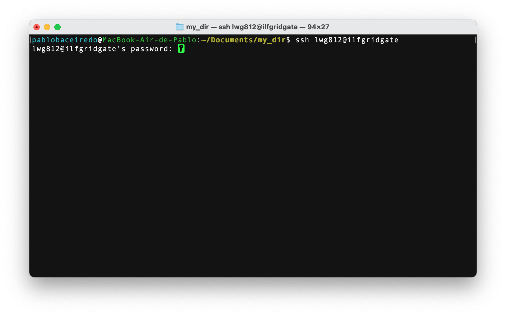

Once accepted, you will have landed in the **login node**. Note that we can know that we are in a remote cluster by reading the part in blue and green before the current directory (yellow). The blue part is the *username* (it changed to my KU ID) and the part in green is the *hostname* (changed from my device's hostname to the ILF Grid hostname)^[Again, you might not see these colors, but no reason to worry about it.].

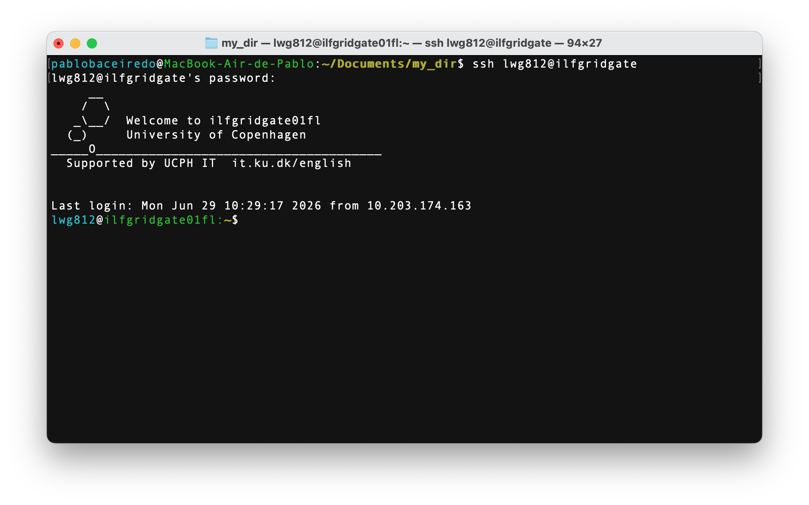


## Submitting jobs

The login node is simply the 'lobby' where you enter the cluster. You can manage files, navigate directories, edit scripts, check job status... However, **you should *never* run heavy computations** (e.g. molecular simulations) on the login node. That is a job for the **compute node**.

The compute node is the powerhouse that executes the heavy jobs. The compute node is protected and cannot be accessed directly. Instead, one can send jobs to run in the compute node using a *job scheduler*, which allocates access to the computational resources, manages the job queue and executes our scripts. The ILF Grid uses Slurm (though there exist other ones).

Here I will cover the very basics on how to submit jobs to the compute node using Slurm. You are welcome to ask ChatGPT et al. on how to do it more sophisticatedly.

1. **Create a batch script.** A batch script is just a regular bash script (with the `.sh` extension) but it has a particular header. The header is just a set of lines at the very top of the script which contain a set of guidelines on how to run the script (subset and number of nodes being used, number of CPU cores, amount of RAM, etc.).
2. **Submitting the script.** The batch script is sent to the job scheduler using the `sbatch` command followed by the file name of the script. A script submitted to run at the compute node is commonly refered to as a *job*.

For example, if we want to run the script `my_job.sh` at the compute node, we would just do the following:

```bash
sbatch my_job.sh
```

After this, we will get a job ID which will serve us to identify it. You can check the queue of all the jobs being run or pending to be run in the department by writing `squeue`. If you write `squeue -u abc123` (where `abc123` is your KU ID) you can check the progress of your jobs.


## Transfering files to and from the cluster

Very frequently you will have to upload some file or directory present in your own PC to the cluster, or vice versa: get something that is in the cluster into your own PC. To do so, it is not as simple as grabbing files and moving them around with the mouse, as we are used to doing in the GUIs of our PCs. We need to something a bit more painstaking. The process is pretty much identical whether you want to transfer files to or from the cluster.

1. In the terminal in your own computer (i.e. not connected to the cluster), navigate to the directory you want to transfer files to or from. Let's say I want to move a file named `transfer.txt` that exists in my remote cluster directory `~/my_remote_dir` to my local directory `~/Documents/my_dir`. First, I would need to go to `~/Documents/my_dir`.

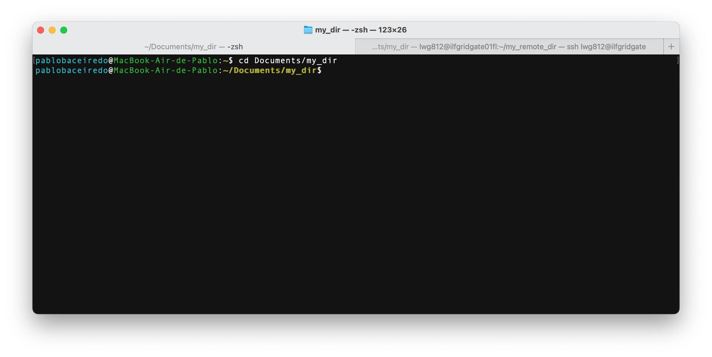

2. There, we connect to the cluster using **sftp**: `sftp abc123@sftp.ku.dk`. Once again, it will ask your password and an authentication method.

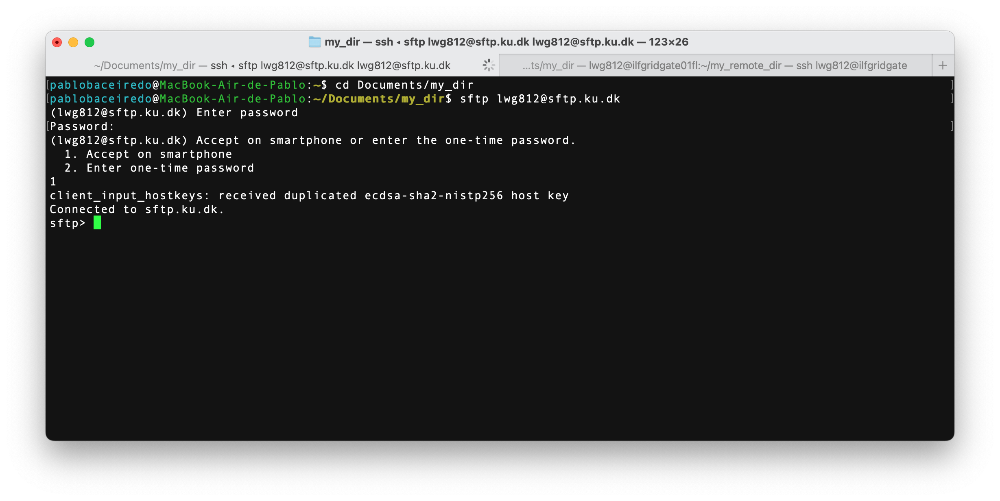

3. Now we are once again connected to the cluster. From there, we navigate to the directory were `transfer.txt` is (in case we want to get the file from the cluster; if we want to put it into the cluster, we navigate to the directory where we want to put the file into). The easiest way to do this is to go to the terminal with our remote connection, typing `pwd` and pasting it to `cd`. Once there, we check that our desired file is there

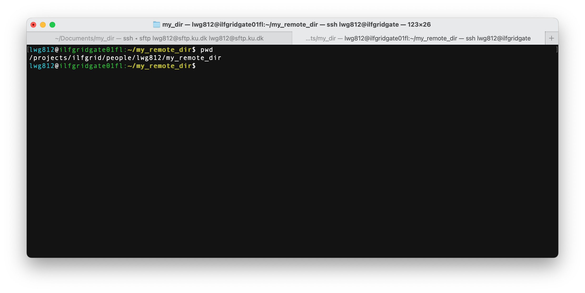
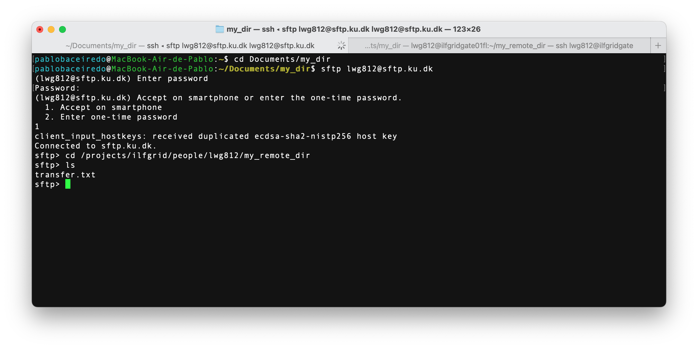

4. Now we get the file using `get transfer.txt`. You will see a confirmation line printed to the screen.
  - Note 1: If we had wanted to put the file in the remote cluster, we do `put transfer.txt`.
  - Note 2: We can also transfer whole directories. To do so, we need add the flag `-r`, e.g. `get -r my_remote_dir`.

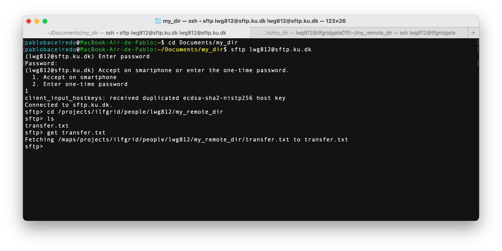


Now we can close our connection with sftp. To close connection either with sftp or the cluster itself, we do `Ctrl + D`.


# Exercises

I know this can be a lot of information to digest and, by the end of the text, I'm sure you will have forgotten half of it^[Best-case scenario, worst-case scenario you never even made it to the end so you are not even reading this.]. Eventually you will learn all of this by heart but, for the time being, I have prepared some treasure hunting-like exercises for you to put all this into practice. Enjoy!

## Find the missing word

The objective of this exercise is to find the hidden 6-letter word. To find it, you just need to join the initial letters of 6 words or concepts that we have worked with. How do you find these 6 words?

In the `exercises` directory you will find 6 directories named `question_1`, `question_2` and so on. Inside each of those there is a file named `question_1.txt`, `question_2.txt`, etc. containing the question that will tell you how to find the 6 words. 

Navigate through these using only terminal commands. What is the hidden 6-letter word?

# Appendix 1: Access rights

Back in the [scripts section](#writing-and-executing-scripts), we had to run `chmod +x my_script.sh` before we could execute our script, and I promised we would explain it later. Later is now.

## Who is allowed to do what

Every file and every directory in the system carries a set of *permissions* (also called *access rights*) that decide **who** can do **what** with it. We can see these permissions with the long listing format of `ls` that we mentioned earlier:

```bash
ls -l
```

The output looks something like this:

```
-rwxr-xr-x  1 pablo  staff    45  Sep  4 12:00  my_script.sh
-rw-r--r--  1 pablo  staff   128  Sep  4 12:00  my_file.txt
drwxr-xr-x  2 pablo  staff    64  Sep  4 12:00  my_dir
```

The part we care about now is the **first column**, that block of 10 characters (e.g. `-rwxr-xr-x`). Let's break it down.

- **Character 1** tells us the *type* of the item: `-` is a regular file, `d` is a directory, and `l` is a symbolic link (a shortcut to another file).
- **Characters 2--4** are the permissions for the **owner** (the user who owns the file, usually the person who created it).
- **Characters 5--7** are the permissions for the **group** (a set of users that the system groups together).
- **Characters 8--10** are the permissions for **others** (everybody else with access to the machine).

Each of those three blocks is always written in the same order, `rwx`, and each letter means:

- `r` (*read*): you can look at the contents of the file, or list the contents of a directory with `ls`.
- `w` (*write*): you can modify the file, or create and delete files inside a directory.
- `x` (*execute*): you can run the file as a program, or enter a directory with `cd`.

When a permission is **not** granted, its letter is replaced by a dash (`-`). So, reading `-rwxr-xr-x` from left to right: it is a regular file (`-`); the owner can read, write and execute it (`rwx`); the group can read and execute it, but not modify it (`r-x`); and others can also read and execute it (`r-x`).

That is exactly why a fresh script does not run: it is created as `-rw-r--r--`, with no `x` anywhere, so the system refuses to execute it and complains with `Permission denied`.

## Changing permissions with `chmod`

To change these permissions we use the `chmod` command (which stands for *change mode*). There are two ways to tell `chmod` what we want: the *symbolic* way and the *numeric* way.

### The symbolic way

The symbolic syntax reads almost like a sentence: `chmod [who][operator][permissions] file`.

- **who**: `u` for the owner (user), `g` for the group, `o` for others, and `a` for all of them at once.
- **operator**: `+` to add a permission, `-` to remove it, `=` to set it exactly (and clear the rest).
- **permissions**: any combination of `r`, `w`, `x`.

Some examples:

```bash
chmod +x my_script.sh        # add execute permission for everyone
chmod u+x my_script.sh       # add execute permission only for the owner
chmod go-w my_file.txt       # remove write permission from group and others
chmod u=rw,go=r my_file.txt  # owner can read and write; group and others can only read
```

When we wrote `chmod +x my_script.sh` in the scripts section, we were simply adding the execute permission to the file.

### The numeric way

You will very often see permissions written as a three-digit number, like `chmod 755`. This works because each of the three blocks (owner, group, others) can be represented by a single digit, obtained by adding up:

- `r` (read) = **4**
- `w` (write) = **2**
- `x` (execute) = **1**

So `rwx` is `4 + 2 + 1 = 7`, `rw-` is `4 + 2 = 6`, `r-x` is `4 + 1 = 5`, and `r--` is just `4`. We then write one digit per block, in the usual order owner-group-others:

```bash
chmod 755 my_script.sh   # rwxr-xr-x : owner can do everything, everyone else can read and execute
chmod 644 my_file.txt    # rw-r--r-- : owner can read and write, everyone else can only read
chmod 700 secret.txt     # rwx------ : only the owner has any access at all
```

In practice, `755` (for scripts and directories) and `644` (for regular files) cover almost everything you will need^[If you ever need something more exotic, this is another perfect question for an LLM.].

### Changing a whole directory at once

Just like with `cp` and `rm`, we can use the `-R` (*recursive*) option to apply a change to a directory and everything inside it:

```bash
chmod -R 755 my_dir
```

As always with recursive commands, double-check the directory name before pressing Enter.

## Why this matters

On your own PC you are usually the only user, so permissions rarely get in your way. But the moment you start working on the **remote cluster**, you are sharing the machine with many other people. Permissions are what stop a stranger from reading your data or editing your scripts --- and, occasionally, what stop *you* from running a script until you remember to add that `x`.


# Appendix 2: Conda environments

In the [Python scripts section](#python-scripts) we described a conda environment as a self-contained 'toolbox' holding a specific version of Python and a specific set of packages. Here we will actually build and use one.

## The problem conda solves

Imagine you have two projects. Project A was written two years ago and needs Python 3.9 and an old version of `pandas`. Project B is brand new and needs Python 3.11 and the latest `pandas`. If you install everything system-wide, the two versions collide and at least one of the projects breaks.

A **conda environment** solves this by giving each project its own isolated directory with its own Python and its own packages. Switching projects becomes as simple as switching environments, and nothing you do in one environment can disturb another.

## Getting conda

Conda comes in two flavours: **Anaconda** (huge, ships with hundreds of packages) and **Miniconda** (tiny, ships with just conda itself and you add what you need). For our purposes Miniconda is more than enough.

- On **your own PC**, download and install Miniconda from its website.
- On the **ILF Grid**, conda is usually already available --- check the [ILF Grid Wiki](https://biowiki.sund.ku.dk/wiki/Main_Page) for the exact way to load it, as it may be provided as a module.

## Creating and using an environment

To **create** a new environment, we use `conda create`, give it a name with `--name`, and (optionally) state which Python version we want:

```bash
conda create --name myenv python=3.11
```

To start using it, we **activate** it:

```bash
conda activate myenv
```

You will notice that your prompt now starts with `(myenv)`. That little label is your reminder of which toolbox is currently open: from now on, `python` and `pip` refer to the ones *inside* `myenv`.

When you are done, you **deactivate** it to go back to the default (`base`) environment:

```bash
conda deactivate
```

## Installing packages

With the environment active, we install packages with `conda install`:

```bash
conda install numpy pandas matplotlib
```

Sometimes a package is not in the default repository and lives in a different *channel* (a repository of packages). The most important community channel is `conda-forge`, and we select it with the `-c` option:

```bash
conda install -c conda-forge mdanalysis
```

A couple of commands to keep track of what you have:

```bash
conda env list   # list all your environments
conda list       # list the packages installed in the active environment
```

And to **delete** an environment you no longer need:

```bash
conda remove --name myenv --all
```

## Reproducing an environment elsewhere

Remember the **reproducibility** argument from the very beginning of the tutorial? Environments have their own version of it. You can *export* the full recipe of the active environment to a file, conventionally named `environment.yml`:

```bash
conda env export > environment.yml
```

Anyone (including future you, or you on the cluster) can then rebuild the exact same toolbox with:

```bash
conda env create -f environment.yml
```

The good practice here is to keep `environment.yml` next to your scripts, so that the code and the tools it needs always travel together.

## Using conda inside a batch script

When you submit a job to the cluster with Slurm, there is no one sitting at the terminal to type `conda activate` for you --- the batch script has to do it itself. Because batch scripts do not run as an interactive login shell, we usually need to point the script at conda explicitly before activating^[If `conda activate` fails inside a script with a message about the shell not being configured, this `source` line is almost always the fix. The exact path depends on where conda was installed.]:

```bash
#!/bin/bash
#SBATCH --job-name=my_analysis
#SBATCH ...   # rest of the header

source ~/miniconda3/etc/profile.d/conda.sh
conda activate myenv

python my_analysis.py
```

## One habit worth keeping

Leave the `base` environment alone and make a **new environment for every project**. Environments are cheap to create and cheap to delete, and keeping them separate is exactly what saves you from the version clashes we started this appendix with.
